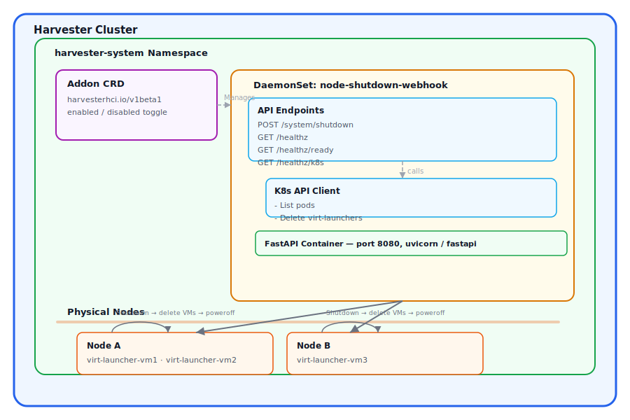

# hvt-shutdown-addons

Secure node shutdown service for Harvester clusters. Deploys as a DaemonSet to safely power off Harvester nodes by gracefully terminating VM workloads.

**Repository:** [github.com/zed378/hvt-shutdown-addons](https://github.com/zed378/hvt-shutdown-addons)

## Overview

This service runs as a DaemonSet on each node in a Harvester cluster. It exposes an HTTP endpoint that accepts authenticated shutdown requests, gracefully terminates all running `virt-launcher` pods on the target node, and then powers off the host system.

## Features

- **Security Hardening**: Rate limiting, audit logging, concurrent shutdown protection, constant-time token comparison
- **Harvester Integration**: Deployed as a Harvester Add-on via `harvesterhci.io/v1beta1` CRD
- **Helm Chart**: Centralized configuration via `Charts/values.yaml`
- **Kubevirt Aware**: Gracefully terminates VM workloads before host shutdown with timeout-based fallback
- **Health Checks**: Liveness, readiness, and Kubernetes connectivity probes
- **UI Extension**: A Rancher/Harvester dashboard tab for entering the auth token, served from a separate in-cluster container and loaded via an internal ClusterIP DNS endpoint (not GitHub Pages)

## Security Features

### Authentication

- **Bearer Token Authentication**: All shutdown requests require a strong Bearer token via `AUTH_TOKEN` environment variable
- **Constant-time Comparison**: Uses `secrets.compare_digest()` to prevent timing attacks
- **No Credential Leakage**: Failed attempts are logged without echoing any token material
- **Consistent 401**: Both missing and invalid tokens return `401` (never a partial-info `403`)
- **Fail-closed Default**: `auth.token` ships empty. If left empty the chart generates a strong random token at install time (readable from the `node-shutdown-auth` Secret); the known default token that previously shipped is now actively rejected at install time

### Rate Limiting

- **Per-Client Sliding Window**: Configurable requests per minute (default: 10), keyed per client IP
- **Applied After Authentication**: Enforced only for authenticated requests, so unauthenticated or failed traffic can never throttle a real emergency (UPS-triggered) shutdown
- **Returns HTTP 429**: When a client exceeds its own budget

### API Surface Reduction

- **Docs Disabled by Default**: `/docs`, `/redoc`, and `/openapi.json` are disabled unless `ENABLE_DOCS=true`, avoiding disclosure of the privileged API surface

### Least-Privilege RBAC

- **Pods-Only Access**: The service account can only read VM instances and `get`/`list`/`delete` pods. It can no longer delete nodes/namespaces/events or patch pod status

### Concurrent Shutdown Protection

- **Atomic Lock Mechanism**: Uses `threading.Lock` for race-condition-free check-and-set
- **Returns HTTP 409**: When shutdown is already in progress

### Audit Logging

- **All Requests Logged**: Method, path, status code, duration, client IP
- **Configurable Path**: Default `/var/log/shutdown-audit.log`
- **File and Stream Handlers**: Dual output for flexible log collection

### Network Security

- **NetworkPolicy Support**: Optional Kubernetes NetworkPolicy to restrict ingress traffic
- **NodePort Access**: Exposed via NodePort with authentication protecting the API

**VIP (Virtual IP)** is any node's IP address in your Harvester cluster, or a load-balancer virtual IP that distributes traffic across cluster nodes. Using VIP allows you to access the API through any node in the cluster via the NodePort.

API base URL (example):

- `http://VIP:30088` (NodePort — replace `VIP` with any cluster node IP or load-balancer VIP)
- Shutdown endpoint: `POST /system/shutdown`
- Health endpoint: `GET /healthz`

### Container Security

- **Minimal Base Image**: Uses `python:3.11-slim` to reduce attack surface
- **Dropped Capabilities**: All Linux capabilities dropped by default

## Quick Start

### 1. Clone the Repository

```bash
git clone https://github.com/zed378/hvt-shutdown-addons.git
cd hvt-shutdown-addons
```

### 2. Generate Secure Auth Token

```bash
# Generate a strong random token
openssl rand -hex 32
```

### 3. Update Configuration

Edit `Charts/values.yaml` and update:

- `auth.token`: Your generated secure token
- `image.registry` and `image.repository`: Your container registry

### 4. Build & Push Docker Images

There are two images — the API backend and the UI extension:

```bash
# API backend (FastAPI, port 8080)
docker build -t your-registry/hvt-shutdown:latest .
docker push your-registry/hvt-shutdown:latest

# UI extension (Rancher UI plugin, built + served by nginx on port 8080)
docker build -f Dockerfile.ui -t your-registry/hvt-shutdown-ui:latest .
docker push your-registry/hvt-shutdown-ui:latest
```

- **`Dockerfile`** — Python FastAPI backend on port 8080.
- **`Dockerfile.ui`** — multi-stage build: Node compiles the Rancher UI extension bundle from `hvt-shutdown-ui/`, then nginx serves the static bundle. Everything needed to build the UI is handled inside the image, so no local Node/Yarn toolchain is required.

Set the image locations in `Charts/values.yaml` (`image.*` and `uiPlugin.image.*`) to match your registry.

### 5. Package and Publish Helm Chart

Each platform has a dedicated script in the `scripts/` directory:

**Linux/macOS (bash):**

```bash
chmod +x scripts/publish_to_github.sh
./scripts/publish_to_github.sh
```

**Windows (PowerShell):**

```powershell
.\scripts\publish_to_github.ps1
```

### 6. Update Addon Configuration

Edit `Charts/addon.yaml` and update the repo URL:

```yaml
spec:
  repo: "https://zed378.github.io/hvt-shutdown-addons/" # Your chart repository URL
```

### 7. Install as Harvester Add-on

```bash
# Apply the Addon CRD
kubectl apply -f Charts/addon.yaml

# Enable the add-on (toggle enabled: true in addon.yaml, or:)
kubectl patch addon node-shutdown -n harvester-system --type=json -p '[{"op": "replace", "path": "/spec/enabled", "value": true}]'
```

There are three ways to configure the Authentication Token:

- **Token Console (works on any Harvester)**: a standalone web page served on its own NodePort (default **30089**) — open `http://VIP:30089`, enter or generate a token, Save. It writes the `node-shutdown-auth` Secret and the change applies within ~1 minute **without restarting** the DaemonSet. See [Token Console](#token-console) below. ⚠ This page is unauthenticated — restrict NodePort 30089 to your management subnet.
- **Harvester UI extension**: navigate to **Advanced -> Addons**, click **Edit Config** on the `node-shutdown` addon — the extension adds a **Node Shutdown Configuration** tab with an **Authentication Token** field. (Requires UI Extensions enabled in the Harvester dashboard.)
- **Before install / via YAML**: edit `auth.token` in `Charts/addon.yaml` (under `valuesContent`) or `Charts/values.yaml`.

If `auth.token` is left empty, the chart generates a strong random token at install time — read it back from the `node-shutdown-auth` Secret:

```bash
kubectl get secret node-shutdown-auth -n harvester-system -o jsonpath='{.data.auth-token}' | base64 -d
```

### 8. Access the API via NodePort

After the DaemonSet is running, you can access the API using the chart's NodePort (default **30088**):

- **Base URL**: `http://VIP:30088` (replace `VIP` with any cluster node IP or load-balancer VIP)
- Replace `VIP` with your Harvester cluster node IP address, e.g., `http://192.168.1.100:30088`

**Health check:**

```bash
curl http://VIP:30088/healthz
```

**Trigger shutdown:**

```bash
curl -X POST http://VIP:30088/system/shutdown \
  -H "Authorization: Bearer your-secret-token"
```

## Architecture



## API Endpoints

### POST /system/shutdown

Initiates a shutdown sequence.

- If called normally (no query param), the service coordinates a **cluster-wide** shutdown by calling peer nodes, then starts the local VM shutdown + host poweroff.
- If called with `?all_nodes=false` (internal/peer calls), it performs **local-only** shutdown.

**Authentication:** Bearer token required in `Authorization` header.

```bash
# NodePort access (recommended)
curl -X POST http://VIP:30088/system/shutdown \
  -H "Authorization: Bearer your-secret-token"

# (Optional) local-only shutdown used for peer coordination
curl -X POST "http://VIP:30088/system/shutdown?all_nodes=false" \
  -H "Authorization: Bearer your-secret-token"
```

**Shutdown Behavior:**

1. Rate limit check (configurable requests per minute)
2. Concurrent shutdown protection (returns 409 if already in progress)
3. List all running pods on the current node
4. Delete `virt-launcher-*` pods with grace period (default: 10s)
5. Wait for VMs to terminate (max: `VM_SHUTDOWN_TIMEOUT` seconds, default: 120s)
6. Attempt host shutdown via fallback chain:
   - `chroot /host systemctl poweroff`
   - `systemctl poweroff`
   - `/sbin/shutdown -h now`

**Response:**

```json
{
  "status": "Shutdown sequence successfully initiated",
  "timestamp": "2026-06-30T04:21:00+00:00"
}
```

**Error Responses:**

| Status Code | Meaning                                         |
| ----------- | ----------------------------------------------- |
| 401         | Invalid or missing authentication token         |
| 409         | Shutdown already in progress                    |
| 429         | Rate limit exceeded                             |
| 500         | Server error (missing config, shutdown failure) |

### GET /healthz

Liveness probe endpoint.

```json
{ "status": "ok", "timestamp": "2026-06-30T04:21:00+00:00" }
```

### GET /healthz/ready

Readiness probe endpoint.

```json
{ "status": "ready", "timestamp": "2026-06-30T04:21:00+00:00" }
```

### GET /healthz/k8s

Kubernetes connectivity health check endpoint. Returns 503 if the Kubernetes client is not initialized or cannot connect.

```json
{
  "status": "ready",
  "k8s": "connected",
  "timestamp": "2026-06-30T04:21:00+00:00"
}
```

## Configuration

All values are in `Charts/values.yaml`:

| Variable                            | Description                               | Default        |
| ----------------------------------- | ----------------------------------------- | -------------- |
| `auth.token`                        | Bearer token for API authentication (set here or via the add-on config; empty = auto-generated random token, fails closed) | `""` |
| `image.registry`                    | Docker image registry                     | zed378         |
| `image.repository`                  | Docker image name                         | hvt-shutdown   |
| `image.tag`                         | Docker image tag                          | latest         |
| `gracePeriodSeconds`                | Pod termination grace period              | 10             |
| `vmShutdownTimeout`                 | Max wait time for VMs before poweroff     | 120            |
| `rateLimiting.maxRequestsPerMinute` | Rate limit threshold                      | 10             |
| `auditLogging.enabled`              | Enable audit logging                      | true           |
| `networkPolicy.enabled`             | Enable Kubernetes NetworkPolicy           | false          |
| `networkPolicy.ingressFromCidr`     | Restrict API ingress to this source CIDR  | null           |
| `tls.enabled`                       | Serve the API over HTTPS (and use HTTPS for peer calls) | false |
| `tls.secretName`                    | Existing TLS secret (`tls.crt`/`tls.key`); empty = chart self-signs | "" |
| `tls.peerVerify`                    | Verify peer certificates during coordination | false      |
| `uiPlugin.enabled`                  | Deploy the UI extension (Deployment + Service) | true       |
| `uiPlugin.createUIPluginResource`   | Create the `UIPlugin` CR so Rancher loads the extension | true |
| `uiPlugin.image.repository`         | UI extension image name                   | hvt-shutdown-ui |
| `uiPlugin.endpoint`                 | Internal DNS endpoint Rancher loads the UI bundle from | `http://hvt-shutdown-ui.cattle-ui-plugin-system.svc:80` |
| `uiPlugin.updateStrategy.maxUnavailable` | Rolling-update max unavailable pods (0 = zero-downtime) | 0 |
| `uiPlugin.updateStrategy.maxSurge`  | Rolling-update surge pods (new pod runs alongside old) | 1 |
| `tokenConsole.enabled`              | Deploy the standalone token console       | true           |
| `tokenConsole.nodePort.nodePort`    | NodePort for the token console UI         | 30089          |
| `tokenConsole.minTokenLength`       | Weak-token warning threshold in the UI    | 32             |

Environment-only knobs (not Helm values): `ENABLE_DOCS` (default `false`) re-enables `/docs` and `/openapi.json`.

## Token Console

The **token console** is a self-contained web UI for setting/rotating the shutdown
auth token that does **not** depend on the Rancher UI-extension framework — it works
on any Harvester. It's served from the same API image as a separate, unprivileged
`Deployment` (`node-shutdown-console`) with a ServiceAccount scoped to write only the
`node-shutdown-auth` Secret, exposed on its own NodePort (default **30089**).

```
http://VIP:30089        # open in a browser, enter/generate a token, Save
```

How it applies without a restart: the DaemonSet mounts the `node-shutdown-auth`
Secret as a file and the API reads the token from it **per request** (`AUTH_TOKEN_FILE`).
When the console updates the Secret, the kubelet syncs the mounted file and the new
token takes effect on every node within ~1 minute — no pod restart, no extra RBAC.

> ⚠ **Security:** the console is intentionally **unauthenticated** and can change the
> credential that gates cluster-wide shutdown. You **must** restrict NodePort `30089`
> to a trusted management subnet with a host firewall (same guidance as the API port).
> Disable it entirely with `tokenConsole.enabled: false` if you don't want it.

## Transport Security (TLS)

By default the API is served over plain HTTP on the NodePort. To encrypt the API
and all peer-to-peer coordination traffic (the bearer token is otherwise sent in
clear text), enable TLS:

```yaml
tls:
  enabled: true
  # Leave secretName empty to let the chart generate a self-signed cert, or
  # point at an existing kubernetes.io/tls secret (e.g. from cert-manager).
  secretName: ""
  peerVerify: false   # self-signed per-node certs => leave false; token still enforced
```

When enabled, the health probes automatically switch to the `HTTPS` scheme, the
cert/key are mounted read-only at `/etc/tls`, and clients must use `https://VIP:30088`.
For a publicly trusted cert, front the NodePort with an ingress/load-balancer that
terminates TLS instead.

## Restricting Access (NetworkPolicy & firewall)

> **Important:** this DaemonSet runs with `hostNetwork: true`. Kubernetes
> NetworkPolicy generally does **not** apply to hostNetwork pods, so the
> authoritative control is a **host firewall** rule on each node (allow TCP
> `30088` only from your management subnet). The chart's NetworkPolicy is
> defense-in-depth for CNIs that enforce it:

```yaml
networkPolicy:
  enabled: true
  ingressFromCidr: "10.0.0.0/8"   # only this source range may reach the API port
```

## Security Best Practices

1. **Generate Strong Tokens**: Always use `openssl rand -hex 32` or similar for auth tokens
2. **Restrict at the Host Firewall**: Limit NodePort `30088` to your management subnet (authoritative for hostNetwork)
3. **Enable NetworkPolicy** where your CNI enforces it: `networkPolicy.enabled: true` + `ingressFromCidr`
4. **Enable TLS**: Set `tls.enabled: true`, or terminate TLS at an ingress/load-balancer
5. **Monitor Audit Logs**: Regularly review `/var/log/shutdown-audit.log`
6. **Rotate Tokens**: Periodically change `auth.token` (in the add-on config / chart values) — it updates the Kubernetes secret
7. **Keep Docs Disabled**: Leave `ENABLE_DOCS=false` in production

## Testing

```bash
pip install -r requirements.txt
pytest tests/ -v
```

## Scripts

All scripts are located in the `scripts/` directory:

| Script                          | Platform             | Description                                |
| ------------------------------- | -------------------- | ------------------------------------------ |
| `scripts/publish_to_github.sh`  | Linux/macOS (bash)   | Publish Helm chart to GitHub Pages as repo |
| `scripts/publish_to_github.ps1` | Windows (PowerShell) | Publish Helm chart to GitHub Pages as repo |
| `scripts/create_release.sh`     | Linux/macOS (bash)   | Interactive GitHub release creator         |
| `scripts/create_release.ps1`    | Windows (PowerShell) | Windows GitHub release creator             |

## Troubleshooting

```bash
# Check addon status
kubectl get addon -n harvester-system

# Check daemonset pods
kubectl get pods -n harvester-system -l app=node-shutdown

# View pod logs
kubectl logs -n harvester-system -l app=node-shutdown

# Check addon events
kubectl describe addon node-shutdown -n harvester-system

# Test health endpoints
kubectl exec -n harvester-system <pod-name> -- curl http://localhost:8080/healthz
```

## Changelog

### v1.3.0 — Token console & live token reload

- **Standalone token console**: a self-contained, network-restricted web UI (`node-shutdown-console`) to set/rotate the auth token, served from the API image on its own NodePort (default `30089`). Works on any Harvester — no Rancher UI-extension framework required. Runs unprivileged with a ServiceAccount scoped to write only the `node-shutdown-auth` Secret. **Unauthenticated by design — restrict its NodePort to a trusted management subnet.**
- **Live token reload**: the API now reads the token from the mounted Secret file (`AUTH_TOKEN_FILE`) per request, so rotating it (via the console or `kubectl`) takes effect within ~1 minute **without restarting** the DaemonSet. Falls back to the `AUTH_TOKEN` env var when the file is absent.
- **UI extension retained** alongside the console (Rancher UIPlugin tab), for environments where UI Extensions is enabled.
- **UI extension serving fix**: the container now serves the extension bundle at the web root (flattened), so the manifest's `main` resolves and Rancher can cache the `UIPlugin` (previously it 404'd and never cached).

### v1.2.0 — Security hardening

- **Fixed dead default-token guard**: the Helm pre-install check compared `auth.token` against a base64 string that never matched the plaintext token it shipped, so a publicly known default token installed silently. The guard now compares the correct plaintext value and fails the install if it is used.
- **Removed committed token**: `values.yaml` and `addon.yaml` no longer ship a real token; `auth.token` defaults to empty and fails closed (auto-generated random token).
- **Rate limiting moved after authentication and made per-IP**: failed/unauthenticated requests can no longer consume the shutdown budget and lock out an emergency shutdown.
- **No credential leakage in logs**; missing tokens now return a consistent `401`.
- **Least-privilege RBAC**: dropped `delete` on nodes/namespaces/events, unused `pods/status` patch, and `uiplugins` write access.
- **API docs disabled by default** (`ENABLE_DOCS=true` to re-enable).
- **Dependencies pinned** with upper bounds; unused `python-multipart`/`python-dateutil` removed. Dockerfile hygiene improvements.
- **Optional TLS**: `tls.enabled: true` serves the API over HTTPS and encrypts peer-to-peer coordination calls; chart self-signs or accepts a bring-your-own secret; probes switch to the HTTPS scheme automatically.
- **NetworkPolicy source-CIDR restriction** wired in via `networkPolicy.ingressFromCidr` (with a documented hostNetwork caveat).
- **UI extension served from internal cluster DNS**: the Rancher UI plugin (the **Node Shutdown Configuration** token tab) is built by a dedicated multi-stage image (`Dockerfile.ui`) and served by an in-cluster nginx `Deployment`/`Service`. Rancher/Harvester loads the bundle from the ClusterIP service DNS endpoint (`http://hvt-shutdown-ui.cattle-ui-plugin-system.svc:80`) instead of GitHub Pages. The `UIPlugin` CR is created by the Helm release (`uiPlugin.createUIPluginResource`).
- **Tests repaired and expanded** to match current behavior, with global state reset between tests.

### v1.1.0

- **UI Plugin Built into Docker Image**: UI static files are built during Docker build and served internally on port 8081
- **UI Plugin Endpoint**: Uses `http://localhost:8081` via hostNetwork for UI serving
- **UIPlugin Resource Support**: Added UIPlugin custom resource for proper Rancher UI Extensions integration
- **ClusterIP Service for UIPlugin**: Automatic ClusterIP allocation for reliable UIPlugin endpoint routing
- **Cluster-wide Shutdown Coordination**: Added peer-to-peer shutdown via HTTP POST to all DaemonSet pods
- **RBAC Enhancements**: Added nodes, events, namespaces, and pods/status permissions for coordinated shutdown

## License

[MIT License](LICENSE)
