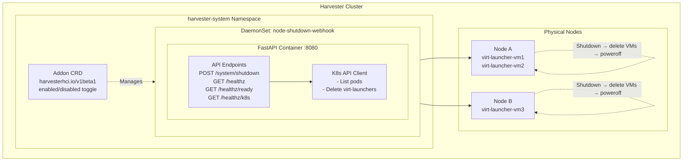

# hvt-shutdown-addons

Secure node shutdown service for Harvester clusters. Deploys as a DaemonSet to safely power off Harvester nodes by gracefully terminating VM workloads.

**Repository:** [github.com/zed378/hvt-shutdown-addons](https://github.com/zed378/hvt-shutdown-addons)

## Overview

This service runs as a DaemonSet on each node in a Harvester cluster. It exposes an HTTP endpoint that accepts authenticated shutdown requests, gracefully terminates all running `virt-launcher` pods on the target node, and then powers off the host system.

## Features

- **Security Hardening**: Rate limiting, audit logging, concurrent shutdown protection, constant-time token comparison
- **Harvester Integration**: Deployed as a Harvester Add-on via `harvesterhci.io/v1beta1` CRD
- **Helm Chart**: Centralized configuration via `Charts/values.yaml`
- **Kubevirt Aware**: Gracefully terminates VM workloads before host shutdown with timeout-based fallback
- **Health Checks**: Liveness, readiness, and Kubernetes connectivity probes

## Security Features

### Authentication

- **Bearer Token Authentication**: All shutdown requests require a strong Bearer token via `AUTH_TOKEN` environment variable
- **Constant-time Comparison**: Uses `secrets.compare_digest()` to prevent timing attacks
- **Empty Token Protection**: Returns 500 if `AUTH_TOKEN` is not configured

### Rate Limiting

- **Sliding Window Algorithm**: Configurable requests per minute (default: 10)
- **Returns HTTP 429**: When rate limit is exceeded

### Concurrent Shutdown Protection

- **Atomic Lock Mechanism**: Uses `threading.Lock` for race-condition-free check-and-set
- **Returns HTTP 409**: When shutdown is already in progress

### Audit Logging

- **All Requests Logged**: Method, path, status code, duration, client IP
- **Configurable Path**: Default `/var/log/shutdown-audit.log`
- **File and Stream Handlers**: Dual output for flexible log collection

### Network Security

- **NetworkPolicy Support**: Optional Kubernetes NetworkPolicy to restrict ingress traffic
- **NodePort Access**: Exposed via NodePort with authentication protecting the API

### Container Security

- **Non-root User**: Dockerfile includes `appuser` for non-root execution
- **Minimal Base Image**: Uses `python:3.11-slim` to reduce attack surface
- **Dropped Capabilities**: All Linux capabilities dropped by default

## Quick Start

### 1. Clone the Repository

```bash
git clone https://github.com/zed378/hvt-shutdown-addons.git
cd hvt-shutdown-addons
```

### 2. Generate Secure Auth Token

```bash
# Generate a strong random token
openssl rand -hex 32
```

### 3. Update Configuration

Edit `Charts/values.yaml` and update:

- `auth.token`: Your generated secure token
- `image.registry` and `image.repository`: Your container registry

### 4. Build & Push Docker Image

```bash
docker build -t your-registry/hvt-shutdown:latest .
docker push your-registry/hvt-shutdown:latest
```

### 5. Package and Publish Helm Chart

Each platform has a dedicated script in the `scripts/` directory:

**Linux/macOS (bash):**

```bash
chmod +x scripts/publish_chart.sh
./scripts/publish_chart.sh
```

**macOS (zsh):**

```bash
chmod +x scripts/publish_chart.mac.sh
./scripts/publish_chart.mac.sh
```

**Windows (PowerShell):**

```powershell
.\scripts\publish_chart.ps1
```

The script creates `charts-output/` directory with the packaged `.tgz` chart and `index.yaml`. Edit `charts-output/index.yaml` and replace the placeholder URL with your actual serving URL.

### 6. Update Addon Configuration

Edit `Charts/addon.yaml` and update the repo URL:

```yaml
spec:
  repo: "https://your-registry.example.com/charts" # Your chart repository URL
```

### 7. Install as Harvester Add-on

```bash
# Apply the Addon CRD
kubectl apply -f Charts/addon.yaml

# Enable the add-on (toggle enabled: true in addon.yaml, or:)
kubectl patch addon node-shutdown -n harvester-local-storage --type=json -p '[{"op": "replace", "path": "/spec/enabled", "value": true}]'
```

## Architecture



## API Endpoints

### POST /system/shutdown

Initiates a graceful shutdown sequence on the node where the service is running.

**Authentication:** Bearer token required in `Authorization` header.

```bash
curl -X POST http://localhost:8080/system/shutdown \
  -H "Authorization: Bearer your-secret-token"
```

**Shutdown Behavior:**

1. Rate limit check (configurable requests per minute)
2. Concurrent shutdown protection (returns 409 if already in progress)
3. List all running pods on the current node
4. Delete `virt-launcher-*` pods with grace period (default: 10s)
5. Wait for VMs to terminate (max: `VM_SHUTDOWN_TIMEOUT` seconds, default: 120s)
6. Attempt host shutdown via fallback chain:
   - `chroot /host systemctl poweroff`
   - `systemctl poweroff`
   - `/sbin/shutdown -h now`

**Response:**

```json
{
  "status": "Shutdown sequence successfully initiated",
  "timestamp": "2026-06-30T04:21:00+00:00"
}
```

**Error Responses:**

| Status Code | Meaning                                         |
| ----------- | ----------------------------------------------- |
| 401         | Invalid or missing authentication token         |
| 409         | Shutdown already in progress                    |
| 429         | Rate limit exceeded                             |
| 500         | Server error (missing config, shutdown failure) |

### GET /healthz

Liveness probe endpoint.

```json
{ "status": "ok", "timestamp": "2026-06-30T04:21:00+00:00" }
```

### GET /healthz/ready

Readiness probe endpoint.

```json
{ "status": "ready", "timestamp": "2026-06-30T04:21:00+00:00" }
```

### GET /healthz/k8s

Kubernetes connectivity health check endpoint. Returns 503 if the Kubernetes client is not initialized or cannot connect.

```json
{
  "status": "ready",
  "k8s": "connected",
  "timestamp": "2026-06-30T04:21:00+00:00"
}
```

## Configuration

All values are in `Charts/values.yaml`:

| Variable                            | Description                           | Default        |
| ----------------------------------- | ------------------------------------- | -------------- |
| `auth.token`                        | Bearer token for API authentication   | **(required)** |
| `image.registry`                    | Docker image registry                 | zed378         |
| `image.repository`                  | Docker image name                     | hvt-shutdown   |
| `image.tag`                         | Docker image tag                      | latest         |
| `gracePeriodSeconds`                | Pod termination grace period          | 10             |
| `vmShutdownTimeout`                 | Max wait time for VMs before poweroff | 120            |
| `rateLimiting.maxRequestsPerMinute` | Rate limit threshold                  | 10             |
| `auditLogging.enabled`              | Enable audit logging                  | true           |
| `networkPolicy.enabled`             | Enable Kubernetes NetworkPolicy       | false          |

## Security Best Practices

1. **Generate Strong Tokens**: Always use `openssl rand -hex 32` or similar for auth tokens
2. **Enable NetworkPolicy**: Set `networkPolicy.enabled: true` to restrict access
3. **Restrict NodePort**: Use firewall rules to limit access to NodePort range
4. **Monitor Audit Logs**: Regularly review `/var/log/shutdown-audit.log`
5. **Rotate Tokens**: Periodically change `AUTH_TOKEN` and update the Kubernetes secret
6. **Use TLS**: Deploy with an ingress controller that provides TLS termination

## Testing

```bash
pip install -r requirements.txt
pytest tests/ -v
```

## Scripts

All scripts are located in the `scripts/` directory:

| Script                         | Platform             | Description                                |
| ------------------------------ | -------------------- | ------------------------------------------ |
| `scripts/publish_chart.sh`     | Linux/macOS (bash)   | Package Helm chart and generate index.yaml |
| `scripts/publish_chart.mac.sh` | macOS (zsh)          | macOS-optimized chart publishing script    |
| `scripts/publish_chart.ps1`    | Windows (PowerShell) | Windows chart publishing script            |
| `scripts/create_release.sh`    | Linux/macOS (bash)   | Interactive GitHub release creator         |
| `scripts/create_release.ps1`   | Windows (PowerShell) | Windows GitHub release creator             |

### Creating a GitHub Release

**Prerequisites:**

- [Helm](https://helm.sh/docs/intro/install/) installed
- [GitHub CLI](https://cli.github.com/) authenticated (`gh auth login`)

**Linux/macOS:**

```bash
# Interactive mode (prompts for version)
./scripts/create_release.sh

# Or with specific version
./scripts/create_release.sh 1.0.0 v1.0.0 "Initial release"

# Create as draft or pre-release
./scripts/create_release.sh 1.0.0 --draft
./scripts/create_release.sh 1.0.0 --prerelease
```

**Windows:**

```powershell
# Interactive mode
.\scripts\create_release.ps1

# Or with specific version
.\scripts\create_release.ps1 -Version "1.0.0" -Message "Initial release"
```

The script will:

1. Package the Helm chart into `charts-output/*.tgz`
2. Generate `index.yaml` for the Helm repository
3. Create a compressed archive of the repository state:
   - **Linux/macOS**: `hvt-shutdown-addons-{version}.tar.gz`
   - **Windows**: `hvt-shutdown-addons-{version}.zip`
4. Place all artifacts in `releases/` directory
5. Provide the `gh release create` command to upload artifacts to GitHub

### Release Artifacts

Each release includes the following files in the `releases/` directory:

| File                                   | Description                             |
| -------------------------------------- | --------------------------------------- |
| `hvt-shutdown-addons-{version}.tar.gz` | Compressed source archive (Linux/macOS) |
| `hvt-shutdown-addons-{version}.zip`    | Compressed source archive (Windows)     |
| `hvt-shutdown-addons-{version}.tgz`    | Packaged Helm chart                     |
| `index.yaml`                           | Helm repository index                   |

## Troubleshooting

```bash
# Check addon status
kubectl get addon -n harvester-local-storage

# Check daemonset pods
kubectl get pods -n harvester-system -l app=node-shutdown

# View pod logs
kubectl logs -n harvester-system -l app=node-shutdown

# Check addon events
kubectl describe addon node-shutdown -n harvester-local-storage

# Test health endpoints
kubectl exec -n harvester-system <pod-name> -- curl http://localhost:8080/healthz
```
